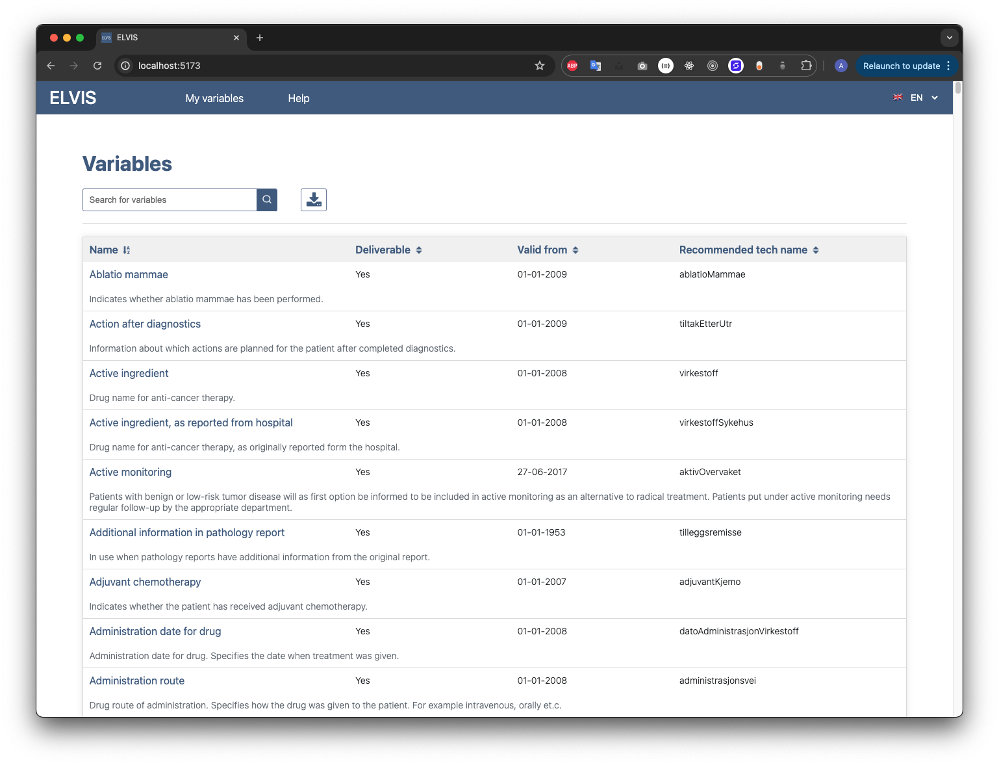

# ELVIS

### Metadata documentation system at Cancer Registry Project

[ELVIS website](https://metadata.kreftregisteret.no/variables)

This is a small project made by HTML/CSS and pure JavaScript for fetching and showing the variables of the cancer registry project in an easy and manageable way. 



## Quick Start

In order to use the application you should first navigate to the root of the project folder with your terminal and then install the packages and dependecies of the project and later on you can run the application by using the following commands:

```
  yarn
  yarn start
```

If you did not have `yarn` package manager you can also use `npm`. 


## HTML

There is only one html page in this application. The index.html file which is the main file that that contains the UI graphics and components taht will be controlled by JavaScript.

## CSS

There is also only one css file in this relateively small project. At the end of each css file we have some media queries to help the application to be playable on a smaller device let's say a mobile phone. 
